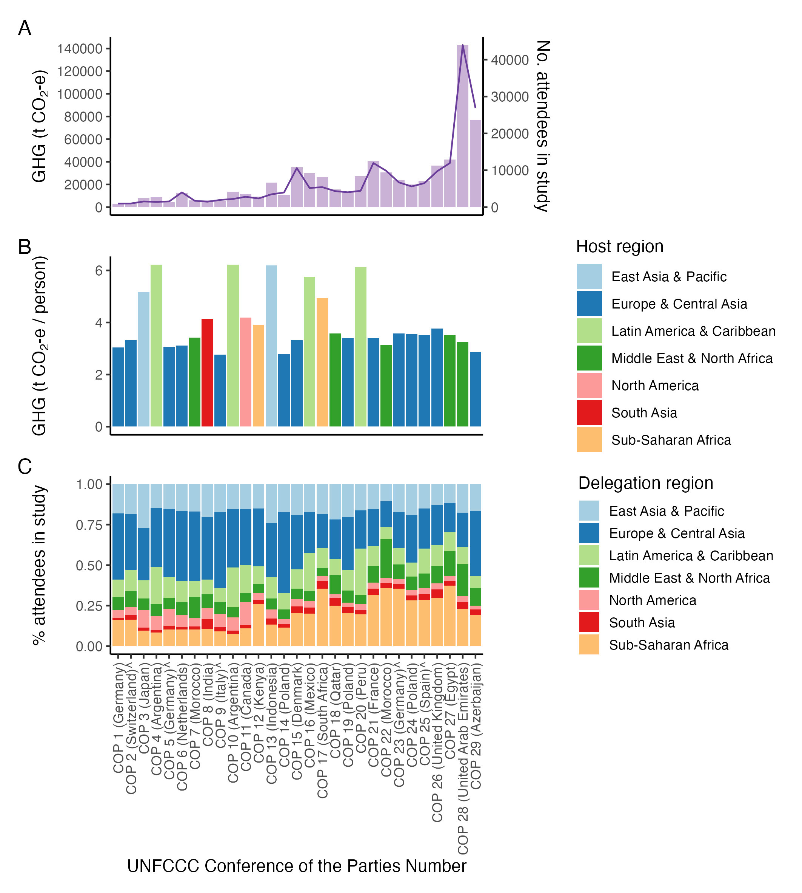
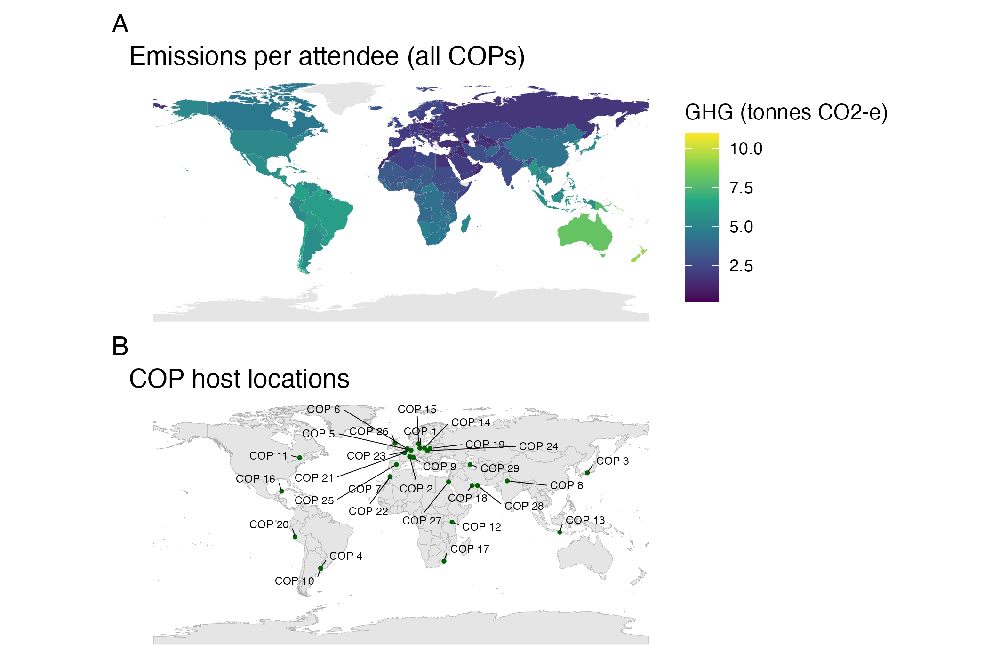

# The carbon footprint of air travel to three decades of UN climate conferences

**Authors:** 
- Jake T. W. Williams, MPH ([ORCID](https://orcid.org/0000-0001-8394-2682)) 
- Philomena Colagiuri, MPH ([ORCID](https://orcid.org/0009-0000-8378-9665))
- Paul J. Beggs, PhD ([ORCID](https://orcid.org/0000-0001-9949-1783))
- Kim Robin van Daalen, PhD ([ORCID](https://orcid.org/0000-0001-6955-9708))
- Aditya Vyas, MBBS MPH ([ORCID](https://orcid.org/0000-0001-6937-3786))
- Arunima Malik, PhD ([ORCID](https://orcid.org/0000-0002-4630-9869))
- Ying Zhang, PhD ([ORCID](https://orcid.org/0000-0001-6214-2440))

**Contact information:** [jake.williams\@sydney.edu.au](mailto:jake.williams@sydney.edu.au)

**Date of creation:** 22 July 2025

This repository includes the code and analysis underlying the Brief Communication entitled "The carbon footprint of air travel to three decades of UN climate conferences" published in [Journal Pending]. It includes code to create summary data and figures.

#### Abstract:

We present the first estimate of greenhouse gas emissions from travel by Party and Observer State attendees to all Conference of the Parties (COP) to the United Nations Framework Convention on Climate Change (UNFCCC) from 1995 to 2024. Emissions totalled 710,282 tonnes CO2-e over the study period and increased 2500% from COP1 (2,959 tonnes CO2-e) to COP29 (76,931 tonnes CO2-e). Emissions per attendee were higher for COPs farther from Europe.

#### Outputs:

The code can be run in full to replicate all analyses and data generated in this study. For convenience the primary outputs are provided in the 'output' directory.

**cop_summary.csv**
Summary data reporting the number of attendees and greenhouse gas emissions for each party to each COP. It the variables Meeting, Delegation, Number, Delegation_ISO, Delegation_wb, Host_ISO, Host_country, Host_wb, Origin, Dest, layover, emissions, emissions_sens_1, emissions_sens_2, and emissions_sens_3.

**figure_1.png**

Figure 1. (A) Total greenhouse gas emissions (tonnes CO2-e) from air travel by Party and Observer State attendees at UNFCCC COP 1-29 (1995-2024) (left y-axis, bar chart). Total number of Party and Observer State attendees at UNFCCC COP1-29 (1995-2024) (right y-axis, line chart).  (B) Per attendee greenhouse gas emissions (tonnes CO2-e) of Party and Observer State attendees from air travel to UNFCCC COP 1-29 (1995-2024). Colours represent the World Bank region of the host country. (C) Proportion of Party and Observer State attendees from different World Bank regional groupings. Note that these regions do not have equal populations (Supplementary Table D). The host country was different to the COP presidency for COP2 (Zimbabwean presidency), COP5 (Polish presidency), COP9 (Hungarian presidency), COP3 (Fijian presidency), and COP25 (Chilean presidency) (indicated with ^). 

**figure_2.png** 
 
Figure 2. Emissions per COP attendee across UNFCCC COP1-29 (1995-2024) by nominating Party. Emissions calculated as the sum of all emissions divided by the sum all attendees per party. (B) Geographical location of UNFCCC COP1-29 (1995-2024). Host country was different to COP presidency for COP2 (Zimbabwean presidency), COP5 (Polish presidency), COP9 (Hungarian presidency), COP23 (Fijian presidency), and COP25 (Chilean presidency). 
